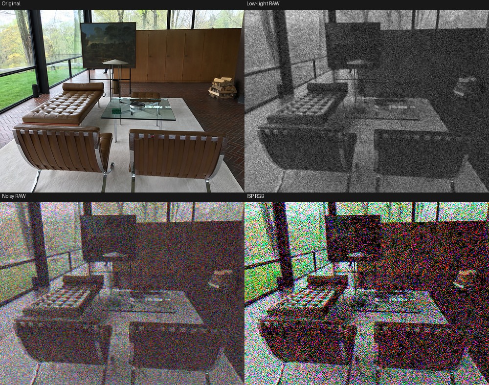
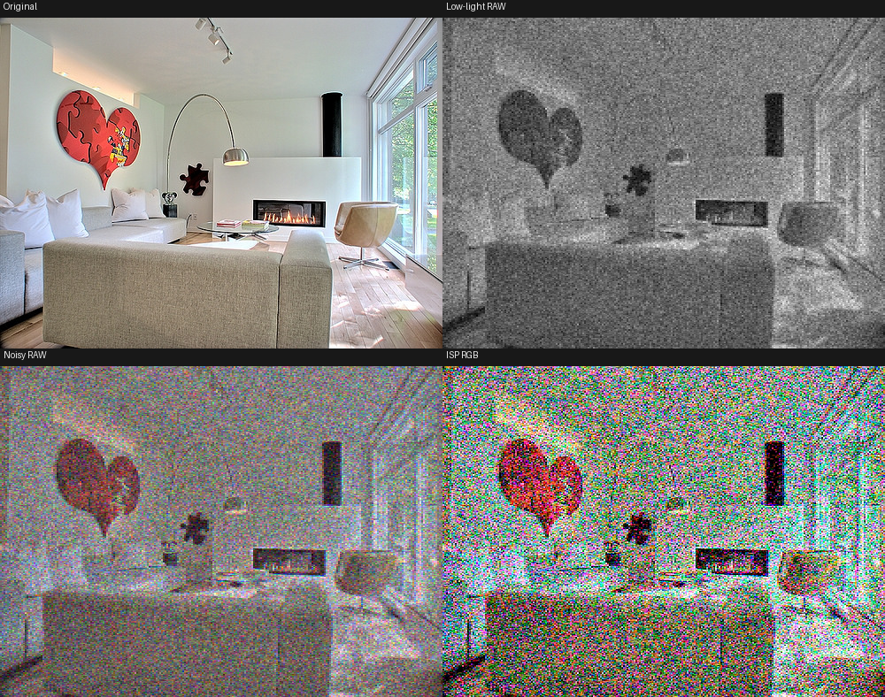
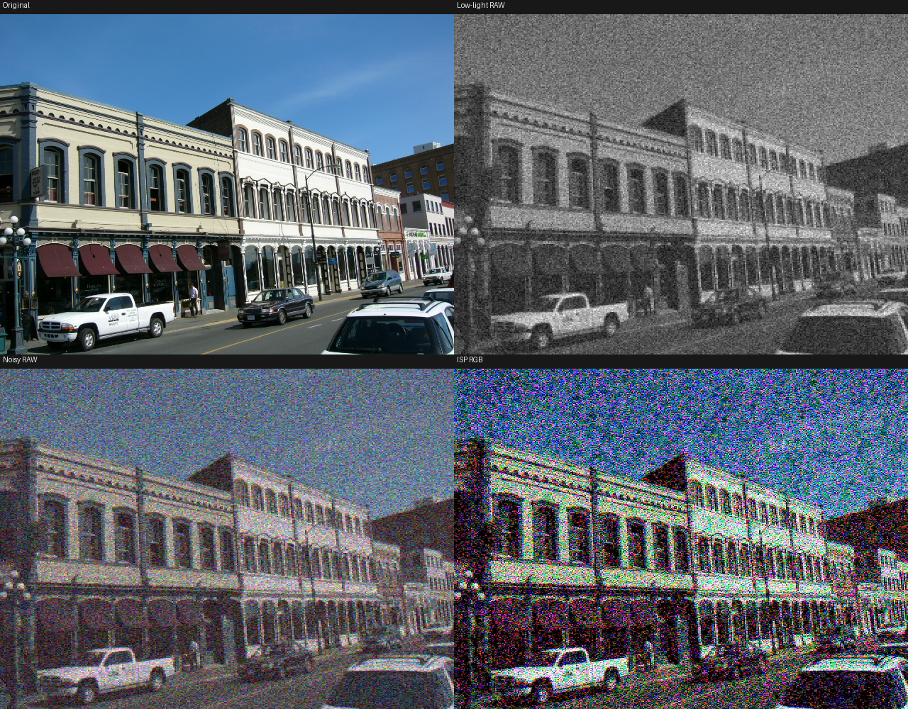
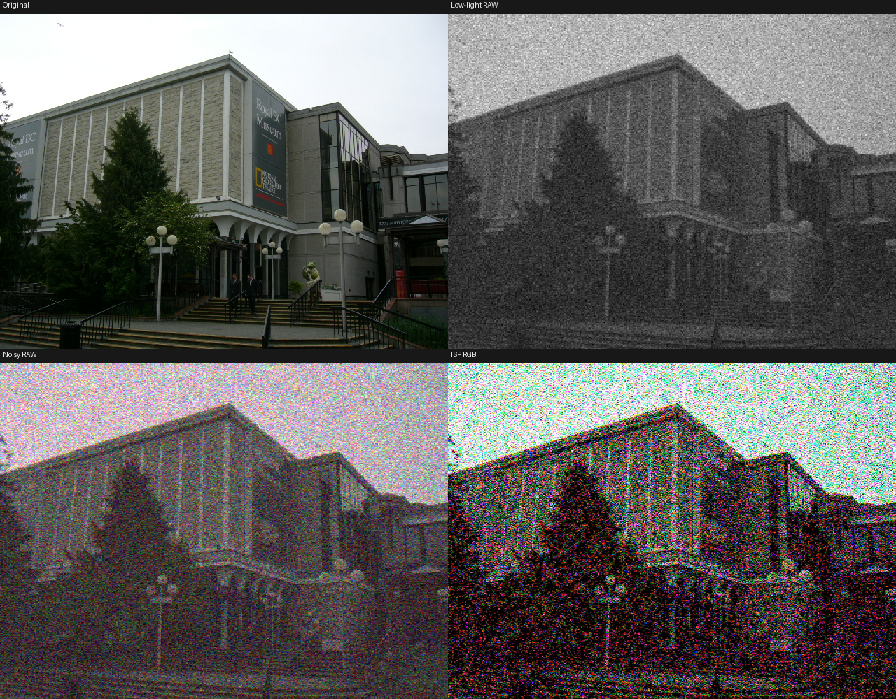
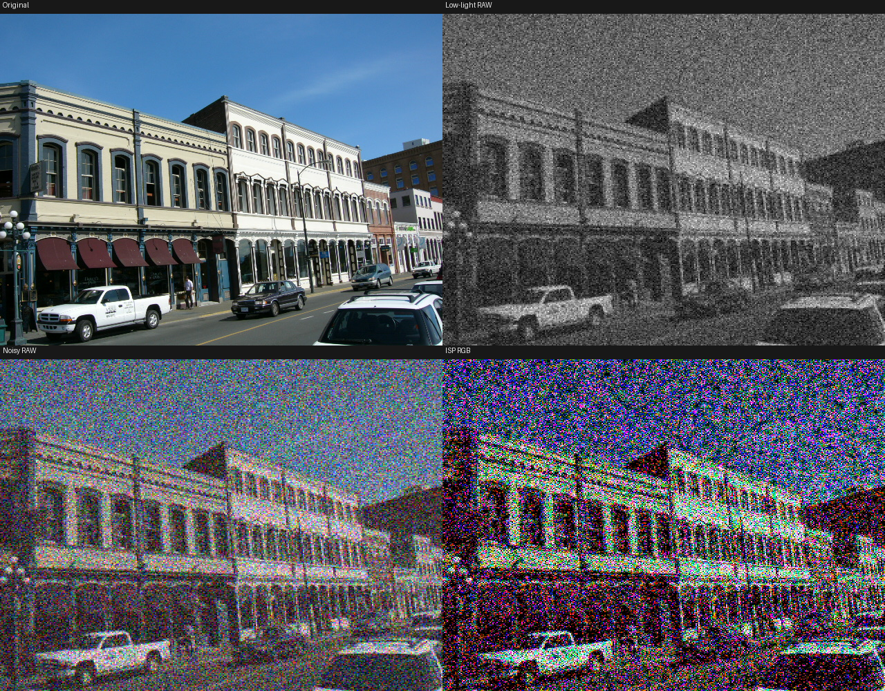

# Pseudo-Low-Light-RAW-Synthesis

This project builds a self-contained pipeline for synthesizing pseudo low-light RAW data from ordinary RGB PNG/JPEG images. It first reconstructs Canon-style pseudo clean RAW with an InvISP inverse model, converts the demosaiced RAW estimate back to a Bayer plane, and then applies an ELD-style physics-based low-light noise model.

## Usage

Two modes are supported:

### 1. Synthesis — save `.npz` data files

```bash
python scripts/synthesize_pseudo_lowlight_raw.py \
  --input /path/to/image.png \
  --output outputs/raw_data \
  --ratio 100 \
  --seed 0
```

Each `.npz` contains `clean_raw`, `low_light_raw`, `ratio`, `noise_params`, and metadata.

### 2. Preview — render a visual preview

```bash
python scripts/preview_pseudo_lowlight_raw.py \
  --input /path/to/image.png \
  --output outputs/preview.png \
  --ratio 200 \
  --seed 0
```

The preview is a 2×2 grid:

| Original | Low-light RAW |
|----------|---------------|
| Noisy RAW | ISP RGB |

- **Original**: the input RGB image
- **Low-light RAW**: clean RAW ÷ ratio + ELD noise, Z-score normalized for visibility
- **Noisy RAW**: the gain-amplified noisy RAW demosaiced
- **ISP RGB**: the noisy RAW passed through the InvISP forward model

Ratio information is embedded in the output filename (e.g. `preview_r200.png`).

## Preview Examples

All examples use `--seed 0` for reproducibility. Each preview is a 2×2 grid: Original | Low-light RAW (Z-score normalized) | Noisy RAW | ISP RGB.

### Ratio 100

**Input: `1.png`**


**Input: `2..png`**


**Input: `3.png`**


**Input: `4.png`**


### Ratio 200 (stronger low-light effect)

**Input: `3.png`**


## Tips

> **This is an approximate synthesis only.** The pipeline has inherent limitations:
>
> - **InvISP** uses a pretrained checkpoint for **Canon EOS 5D** — an invertible ISP model that learns to map between RAW and RGB for a specific camera. It is not a universal JPEG-to-RAW converter. We rely on its limited cross-camera generalization to approximate RAW reconstruction from arbitrary input images.
> - **ELD** noise parameters are calibrated for **Canon EOS 5D Mark IV**. The noise profile (K, g_scale) is camera-specific and does not match the actual sensor characteristics of the device that captured the input image.
> - The input image's original ISP pipeline (white balance, color correction, tone mapping, gamma) and the synthetic pipeline's assumptions may differ substantially.
>
> Results are best interpreted as plausible pseudo-RAW approximations for data augmentation or algorithm prototyping, not as physically accurate RAW measurements.

## Method

The synthesis pipeline is:

1. Load an RGB PNG/JPEG image as float data in `[0, 1]`.
2. Crop the image to even height and width so Bayer extraction is valid.
3. Run the InvISP Canon model in inverse mode to estimate demosaiced pseudo RAW.
4. Extract a single-plane Bayer RAW image using the configured CFA pattern (RGGB).
5. Apply the ELD baseline Poisson + Gaussian noise model:
   - scale by `saturation_level`
   - divide by the exposure `ratio`
   - apply shot noise and read noise
   - multiply by the same `ratio`
   - divide by `saturation_level`
6. Pack clean and low-light Bayer RAW as `4 × H/2 × W/2` arrays in RGGB order.
7. Save one `.npz` per input image and ratio (synthesis mode) or render a preview PNG.

## Installation

### Requirements

| Dependency | Minimum Version | Notes |
|-----------|----------------|-------|
| Python | 3.10+ | |
| PyTorch | 2.0+ | CUDA recommended for GPU acceleration |
| NumPy | 2.0+ | |
| Pillow | 10.0+ | |
| pytest | 7.0+ | for running tests |
| tqdm | 4.0+ | optional, for progress bars |

**Development environment:** Python 3.10.20, PyTorch 2.12.0 (CUDA 13.0), NVIDIA GeForce RTX 5060.

### Setup

```bash
pip install -r requirements.txt
```

For PyTorch with CUDA support, follow the [official installation guide](https://pytorch.org/get-started/locally/) matching your CUDA version.

### Required Assets

The following project-owned assets must be present:

```text
assets/checkpoints/invisp_canon_eos_5d.pth
assets/camera_params/CanonEOS5D4_params.npy
```

## Testing

```bash
python -m pytest tests -q
```

## Acknowledgements

### Reference Projects

This repository contains vendored reference projects under `third-party/`. They are not imported by the final runtime package, but they informed the implementation and supplied required assets.

- `third-party/Invertible-ISP`: reference InvISP implementation and Canon EOS 5D checkpoint used for RGB-to-RAW inversion.
- `third-party/ELD`: reference ELD noise model and Canon EOS 5D Mark IV calibrated camera noise parameters.
- `third-party/DarkFeat`: reference low-light RAW feature pipeline.

Please cite and follow the licenses of the original projects when using this repository in research or derived work.

### Development

This project was developed with the assistance of AI coding agents and models:

- **[Claude Code](https://claude.ai/code)** — Anthropic's agentic coding tool, used for architecture design, implementation, code review, and iterative refinement.
- **[Codex](https://codex.com)** — OpenAI's coding agent, used for parallel investigation and rescue tasks during development.
- **[DeepSeek V4 Pro](https://deepseek.com)** — the underlying language model that powered the Claude Code sessions throughout development, handling code generation, analysis, and decision-making.

We are grateful to the teams behind these tools for enabling rapid, high-quality research-code development.
